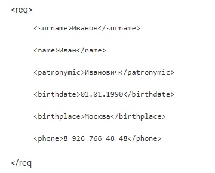

# Знакомство с веб-технологиями (семинары)

## Урок 5. JSON и XML

<u>***Задача 1:***</u>

- проверить XML на Well formed;

:point_right: [Правильный вариант]( "Открыть")

Проверить можно на сайте jsonformatter:

:point_right: [Перейти для проверки](https://jsonformatter.org/xml-formatter "Открыть")

- проверить JSON на Well formed:

>{
>
> "surname": "Иванов"
>
> "name": "Иван"
>
> "patronymic": "Иванович"
>
> "birthdate": "01.01.1990"
>
> "birthplace": "Москва"
>
> "phone": "8 926 766 48 48"
>}

:point_right: [Правильный вариант]( "Открыть")

Проверить можно на сайте jsonformatter:

:point_right: [Перейти для проверки](https://jsonformatter.org/json-parser "Открыть")

---

<u>***Задача 1:***</u>

Создайте 2 файла json и xml одной и той же структуры данных.
Больница с пациентами и врачами, в больнице могут быть палаты, кабинеты, у людей могут быть карманы.

:point_right: [Перейти к решению]( "Открыть")

Проверить можено на сайте jsonformatter:

:point_right: [Перейти для проверки](https://jsonformatter.org/xml-formatter "Открыть") - XML
:point_right: [Перейти для проверки](https://jsonformatter.org/json-parser "Открыть") - JSON
